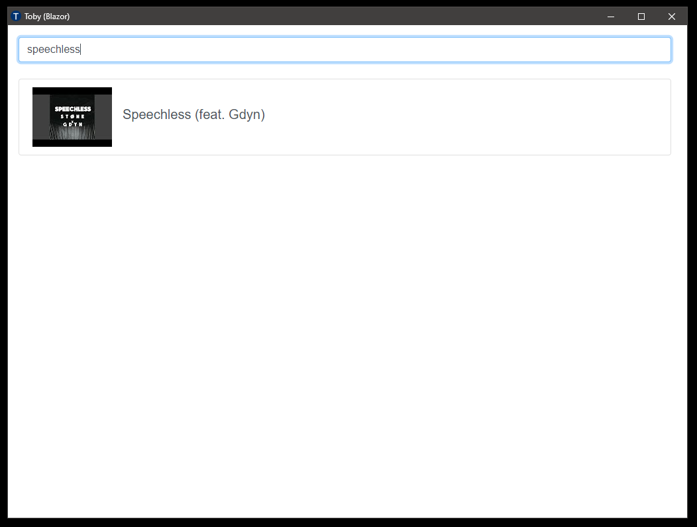
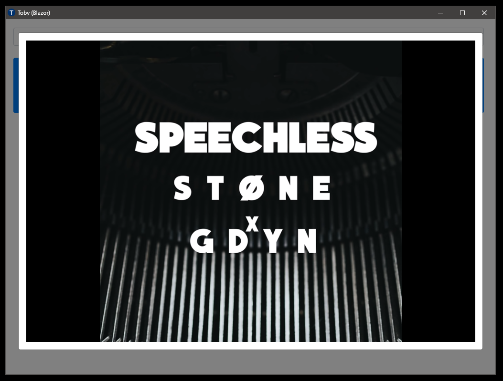

# toby-blazor

Possibly one day a rewrite of [Toby](https://github.com/frankhale/toby) using Blazor

## Status

Right now this is very naive and rough. I'm using this to learn Blazor. There
are all sorts of really bad things going on here right now. The database
shipping in the repo is a slighly modified one from [Toby](https://github.com/frankhale/toby).

There is currently no UI to add/edit videos. I'm using [DB Browser](https://sqlitebrowser.org/) to edit the SQLite db directly. Additionally there is no
functionality to search YouTube using the YouTube Data API.

I'm using the latest Visual Studio 2019 Preview with .NET Core 3.1 preview3 to
compile and run this.

NOTE: Project is currently set for HTTPS which if we ultimately run inside a
NW.js or Electron context we'd switch to HTTP to avoid the DEV self signed
certificates. I don't think there is any real story around using a client/server
approach with HTTPS in a NW.js or Electron deployment scenario to a personal
machine. I tried Googling but didn't find anything. Not sure if it would make
much difference at all... I am not a security expert.

## Searching For Videos

Currently searching is very crude. If you enter a search term it is compared
against video titles and if the search term is contained in the title the
results are displayed. You can enter `/all` to return all the videos in the
database.

## Screenshots

## Folder Layout

- server: Blazor server-side project
- client: This is just quick and dirty driver to open `toby-blazor` in NW.js

NOTE: I'm not really doing anything with NW.js and it's included here as an
aside. If this ever becomes a thing I'll persue a better deployment scenario
for NW.js and/or Electron.

## Author(s)

Frank Hale &lt;frankhale@gmail.com&gt;

## Date

19 November 2019
