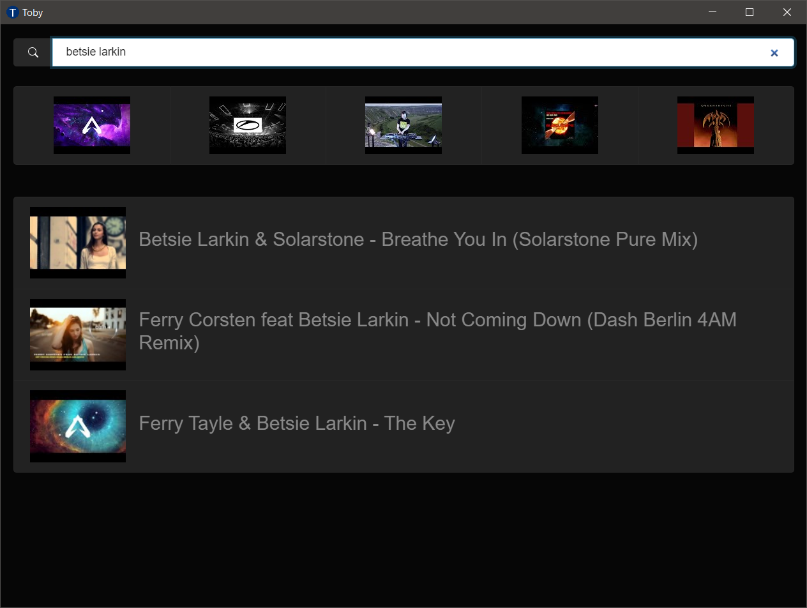
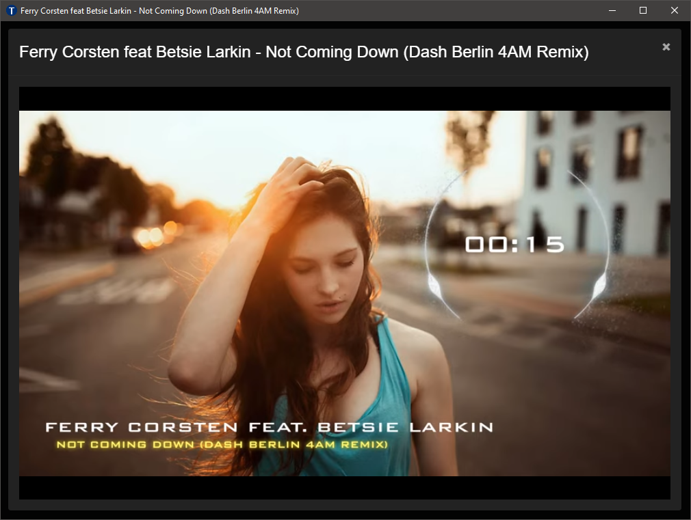
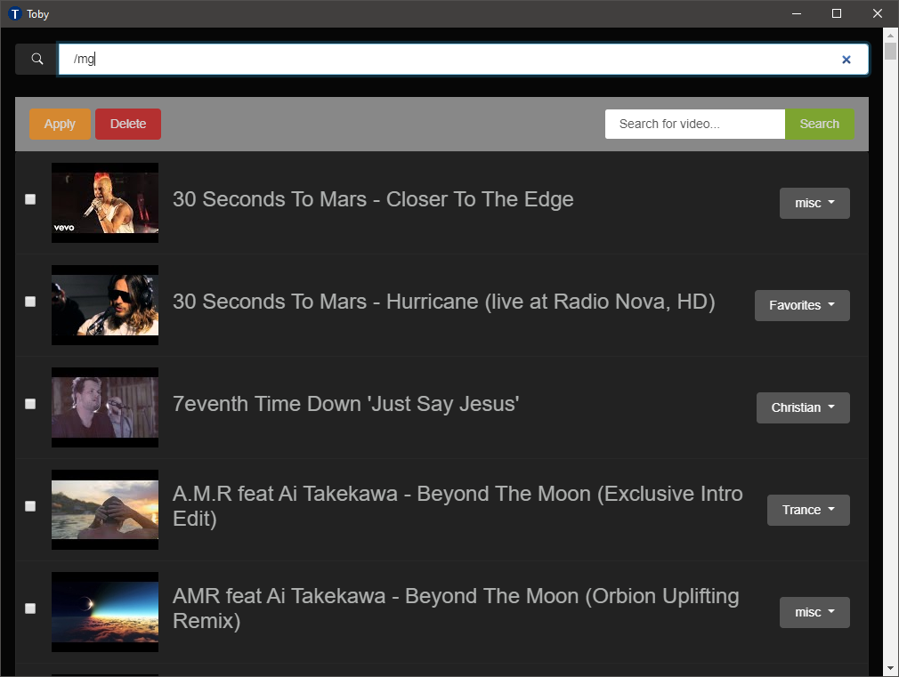
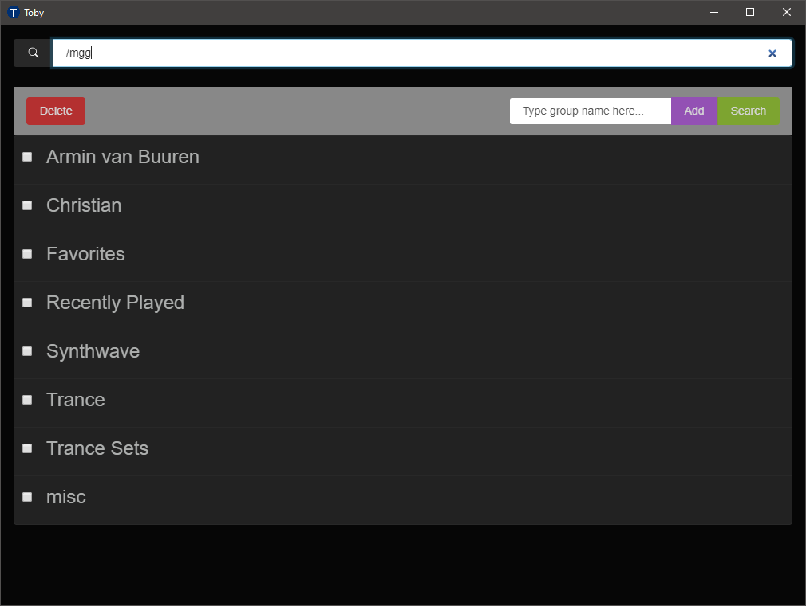

# Toby (Blazor)

**Requires: .NET 8**

This is a rewrite of [Toby](https://github.com/frankhale/toby) using C# and
Blazor. This project is using the server-side hosting model.

This is a simple YouTube player for your favorite videos.

## Status

We are using SQLite with Entity Framework Core which makes it easy to interface
with our database. I'm using [DB Browser](https://sqlitebrowser.org/) as a way
to manage the db graphically.

The UI is built with Bootstrap. I'm using Bootstrap directly at the moment
instead of using libraries such as [BlazorStrap](https://github.com/chanan/BlazorStrap)
or [Blazorise](https://github.com/stsrki/Blazorise). I'm using the Cyborg theme
from [Bootswatch](https://bootswatch.com/).

## Usage

NOTE: Currently the database shipping in the repo is a slighly modified one from
[Toby](https://github.com/frankhale/toby). It's pre-populated with videos I like
(LOL!). Use the command `/all` to list them or `/manage` to delete them all. Or
if using Visual Studio you can just delete the included database and run the
Entity Framework migration to create an new empty database.

NOTE: If you want to search YouTube you'll need a YouTube Data API key. This
code needs to be added to an environment variable on your machine called
`YOUTUBE_API_KEY`.

To obtain a YouTube Data API key you need a Google account and need to go to
[Google's developer console](https://console.developers.google.com/) to obtain
one.

Search commands:

- `/all` or `/ls`: lists all videos in the database
- `/clear`: clear search results
- `/crp` or `/clear-recently-played`: clear recently played
- `/group [name]` or `/g [name]`: lists videos in a specific group
- `/favorites` or `/fav`: list favorite videos
- `/manage` or `/mg`: video management
- `/manage-recently-played` or `/mgrp`: recently played management
- `/manage-groups` or `/mgg`: group management
- `/recently-played` or `/rp`: list all recently played videos
- `[search term]`: search locally for video
- `/youtube [search term]` or `/yt [search term]`: search YouTube for videos

**NOTE:** When using `manage` there is a search box to search within the videos
you are managing. You can use `/all` to show all videos after a narrow search.

The Recently Played videos are limited to 30 videos.

## Screenshots

### Basic UI with Recently Played Preview

### Video Playback

### Video Management

### Group Management

## Folder Layout

- server: Blazor server-side project
- client: Electron and NW.js drivers

## Author(s)

Frank Hale &lt;frankhale@gmail.com&gt;

## Date

23 May 2024

## License

MIT - see [LICENSE](LICENSE.txt)
