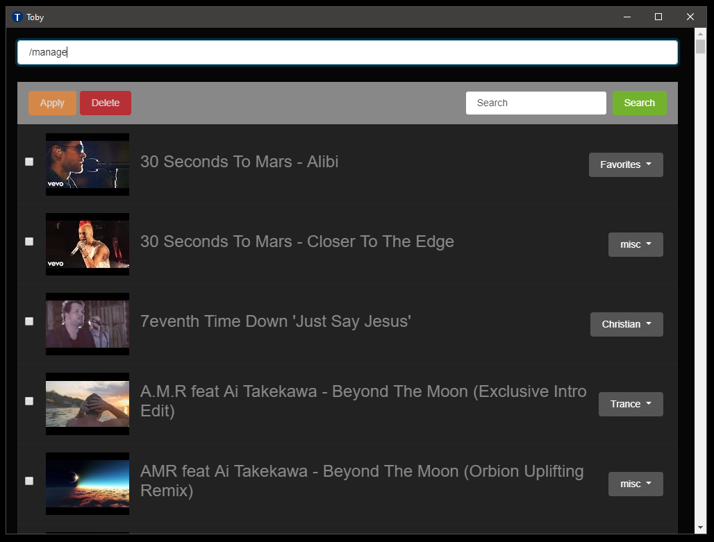

# Toby (Blazor)

This is a rewrite of [Toby](https://github.com/frankhale/toby) using Blazor.
This project is using the server-side hosting model.

## Status

This is an effort to learn more about Blazor and how to build apps in it. The
database shipping in the repo is a slighly modified one from [Toby](https://github.com/frankhale/toby).

I'm using the latest Visual Studio 2019 Preview with .NET Core 3.1 preview3 to
compile and run this.

NOTE: Project is currently set for HTTPS which if we ultimately run inside a
NW.js or Electron context we'd switch to HTTP to avoid the DEV self signed
certificate.

## Usage

NOTE: The database is pre-populated with videos I added when developing
[Toby](https:/github.com/frankhale/toby). Use the command `/all` to list them.
There are videos in the following groups `trance, christian, misc`.

NOTE: If you want to search YouTube you'll need a YouTube Data API key. This
code needs to be added to an environment variable called "YOUTUBE_API_KEY".

Search commands:

- `search [term]`: search locally for video
- `/all` or `/ls`: lists all videos in the database
- `/group [name]` or `/g [name]`: lists videos in a specific group
- `/youtube [name hint]` or `/yt [name hint]`: search YouTube for videos
- `/recently-played` or `/rp`: list all recently played videos
- `/favorites` or `/fav`: list favorite videos
- `/manage` or `/mg`: video management

## Screenshots

## Folder Layout

- server: Blazor server-side project
- client: This is just quick and dirty driver to open `toby-blazor` in NW.js

NOTE: I'm not really doing anything with NW.js right now and it's included here
as an aside. I'm making quite a lot of progress right now so I'll persue a
better deployment scenario for NW.js and/or Electron soon.

## Author(s)

Frank Hale &lt;frankhale@gmail.com&gt;

## Date

24 November 2019
